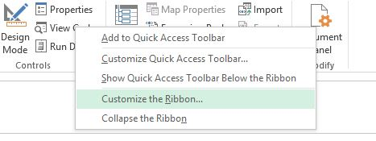
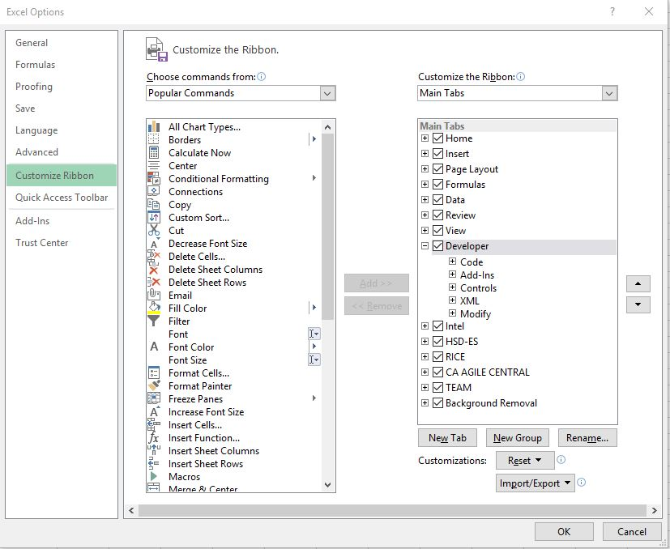

[index](Index.md)
# Getting Started with VBA Macro

* **Right click ribbon**  
    click on Customize the Ribbon  
     
* check **developer** checkbox in main  
    
* go to developer menu and click  “view code” to see/write codes
    * link to learn more: [macro for beginners](https://powerspreadsheets.com/excel-macro-tutorial-for-beginners/)
* The window components need to know about  
      
    1 The Menu Bar  
    2 The toolbar  
    3 Project window (ctrl + R to show)  
    4 properties window ( F4 to show)    
        - This is good for changing properties of any macro items.   
    5 Code window   
    6 Immediate Window (ctrl +G to show )  
        - This is important for debug. 

[index](Index.md)