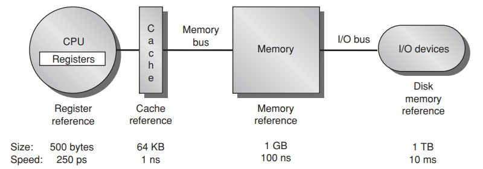
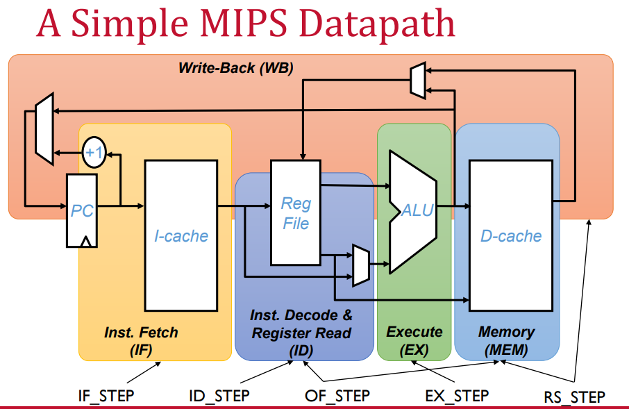

# computer Architecture  

## Instruction level parallelism (ILP)  
1. one approach relies on hardware  
2. the other one is relying on the compiler.  

### data dependencies  

one instruction is depending on the data from other instruction. 

### name dependences  

two instructions are using the same registers.  
1. **antidpenedence**  j writes to a register and i reads from that . 
1. **output dependence** two instructions writes to same register. ordering must be preserved.  
register renaming can be done statically by a compiler or dynamically by the hardware.  

### data hazards  

#### WAR - Write after read  
j tries to write before i reads it the old data form register.  

#### WAW - Write after write  
j tries to write before i writs data to register. writing opposite order cause wrong data to read.  
instruction continues to proceed even if the i is stalled. 

#### RAW - Read after write  
j tries to read before i writes it. 

Note: read after read is not a hazard.  

### control dependences  
1. can not move any instruction from inside control statement to outside. 
2. can not move any instruction from outside to inside. 

A control dependences determines the execution of the order. 

## Memory Hieararchy

1. temporal locality  
1. spatial locality  

  

	Each core has L1 cache and L2 cache but L3 cache is common for all core. 
	
word
line/block = multiple words  

design decision : where blocks/lines can be placed in cache. 
	popular scheme is: set associative   
	set is a group of block in the cache.  
	a block is first mapped onto a set and the block can be placed anywhere in the set  
	if there are n block in a set then this is called n way set associative.  
	caching data that is read only easy.  
	but write is difficult  
### how can the data be ensured to be kept consistant.  

1. Write Through - update in cache and memory both.  
1. write back - write back to memory only occurs when it is about to be replaced.  
		both aproach can user write buffer to allow cache to proceed .  

	Miss Rate: 
	number of access missed from cache / total access attempt. 

### cache block:  

	cache is like table.  
	each row is a set  
	direct map => each row has one column => associativity =1  
	Fully associative = 1 row 
	cache block is one set and one column
	a data from memory can be put into cache using a mod calculation. 
	set index = block number modulo number set

how to find if a block is in upper level: 
	there are 4 main things block address / tag / index / block offsets. 
	increasing associativity shrink index. expands tags. 
	

Three C miss category:  
1. Compulsory - first access must be from non cache.  
1. Capacity - cache is full. it contains all the block needed for execution.  
1. Conflict - if the block placement strategy is not fully associative.  

Some designer prefers Misses/ instruction  instead of miss rate.  

Avg memory access time = hit time + miss rate x miss penalty  

Processor can execute other instruction during the miss time.  

### Q1: where can a block be placed? 

1. **direct map:** If each block has only one place in the cache.  
1. **fully associative:** If a block can be placed anywhere.  
1. **set associtive:** if a block can be placed in restricted set of places.  
    if there are n blocks in a set then it is called *n-way set associative*  

### Q2: how a block can be found?  

caches have an address tag on each block.  

--------------------------------------------------------
|                  Block address             |  Block  |
--------------------------------------------------------
|   Tag                   |         Index    |   offset|
--------------------------------------------------------

**Virtual memory :** it means some objects can live on disk. Address space is broken into fixed size blocks called pages.  
At any time each page resides either in main memory or disk.  
when page fault occurs (missing page in memory) then entire page moved to memory and during this time CPU is free.  
virtual space is bigger than physical  
each process has its own page entry.  

**page entry:** contains  
1. physical page number  
2. valid bit  
3. dirty bit  
4. use bit  
5. protection field  
6. disk address.  

### how to improve the miss rate  

1. Large block size - use large block can cause miss penalty. Does larger block causes longer hit time?  
1. bigger cache - causes longer hit time  
1. Higher associativity - with the cost of hit time.  
1. Multilvl cache - reduce miss penalty  
	HT(L1) + MR x (HT(l2) + MR(L2) x Miss penalty(L2))  
1. give priority to read misses orver write (use write buffer)  
1.

## pipeline  

Every instruction of RISC requires 5 cycles  
  

#### IF: Instruction fetch cycle  

send program controller (pc) to read the instruction  
update PC by 4 as each instructionis 4 byte.  

#### ID: Instruction Decoe   

Decoding is done in parallel with the wregister reading.  

#### Ex: Execution  

ALU operates on operands  
ALU adds the base register and offset to form effective address  
ALU performa operation specied by opcode.  

#### Mem: memory access  

if instruction is load it reads memeory using the effective address.  
if instruction is write it writes to the effective address  

#### WB: write back  

Write the results in register

## Processors virtual address space.  

	- stack grows high to low.  
	- heap grows low to high  
	- code is in the bottom  
	- data is next  
	- segfault occurs if stack and heap overlaps  
	- Unallocated memory is protected  
	- text and data is read only  
	
## Acronyms:

shot | meaning
---|----
CAS| Column Access Strobe
RAS|Row access strobe
ILP|instruction level parallelism
TLP|Thread level parallelism
CPI|Cycle per instructions
MIPS|Microprocessor without Interlocked Pipelined Stages
RISC|Reduce instruction set computer

## Questions  

1. What is the cache size for ADL CPU?  
1. what is the limitation to give extra large cache memory ? only cost and size?  
1. What is conflict miss.  
1. how to find a data if it is in cache?  

## good links

[class lecture stoney brook](https://compas.cs.stonybrook.edu/~nhonarmand/courses/sp16/cse502/slides/)  
