# Enable remote connectivity for Coengineering. 
----

- Contents
  * [Install / enable prerequisite](#install---enable-prerequisite)
  * [Register/reserve the system](#register-reserve-the-system--should-be-done-by-admin-)
  * [system information](#system-information)
  * [Authenticate the client pc by adding public key](#authenticate-the-client-pc-by-adding-public-key)
  * [Tunnel configuration](#tunnel-configuration)
    + [Gateway configuration](#gateway-configuration)
    + [client configuration](#client-configuration)
  * [Connecting to the system](#connecting-to-the-system)
  * [For file transfer need to have sftp tunnel configured on port 22. And need to ensure the SUT is running with the SFTP server on port 22.](#for-file-transfer-need-to-have-sftp-tunnel-configured-on-port-22-and-need-to-ensure-the-sut-is-running-with-the-sftp-server-on-port-22)
      - [useful links](#useful-links)


## Install / enable prerequisite  

1. Download and install putty. [download link](https://www.putty.org/)  
1. get access for any link in the bottom if needed. [optional]  


## Register/reserve the system [should be done by Admin]  


## system information  

system id|locker id|gateway ip|certificate common name
:--:|:-----:|:-----:|:-------:
107269   |5061     |192.55.64.252|intelsdp5061

## Authenticate the client pc by adding public key 

1. launch `puttygen.exe` from putty installation location.  
1. click generate and keep moving mouse over the open area.  
1. **warning** Make sure RSA is selected and Number of bits in a generated key is **4096**  
	- 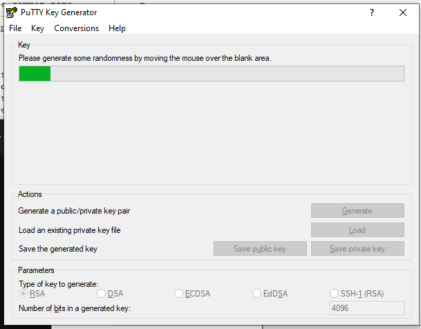  
1. Enter a strong passphrase for key and confirm, then save the private key to a subfolder inside your Documents folder.  
	- **warning** do not click `save public key` button. 
	- 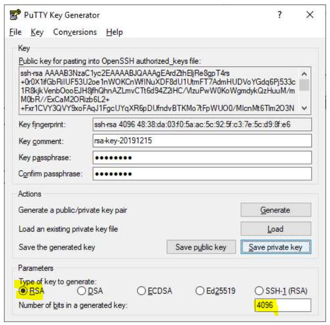
1. select everything under `public key for pasting into OpenSSH authorized_keys file` and copy to notepad , save as MyPublicKey.  
1. you should have a instruction email with a link to provide public key.  
	- post the content of MyPublicKey to the link.  
	- **warning** it must starts with ssh-rsa  
	- close the puttygen.exe application.  

## Tunnel configuration  

### Gateway configuration

1. right click on the private key file and open with `Putty SSH authentication agent`.  
	- If prompted password please provide as setup earlier.  
1. launch putty.exe create a session called `onecloudgw` with host as `guest@<ssh-gw-server-ip-address>`.  
	- 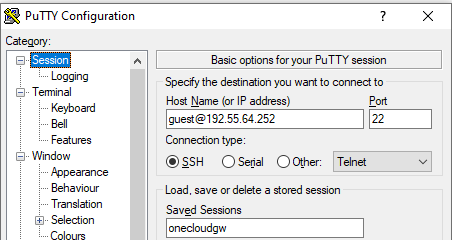  
1. proxy should be configured if someone tries to access from intel VPN  
	- `connect %host %port\n`  
	- proxy: `proxy-us.intel.com`  `1080`  
	- 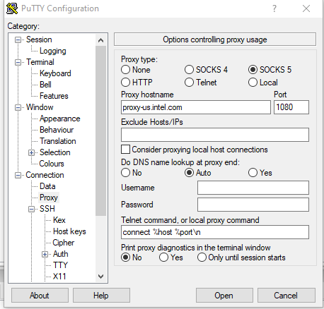  
1. For external access skip the previous step and select proxy none  
	
### client configuration

1. Launch putty.exe again and create a session **onecloudeclient**  
	- hostname: `sdp@<os ip address>`  
	- OS ip address can be obtained from the instructions email from intel SDP.  
	- 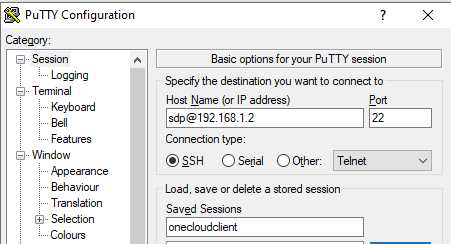  
1. Go to connection->proxy 
	- proxy type: `local`  
	- Telnet command or local proxy command: `"C:\Program Files (x86)\PuTTY\plink.exe" -load onecloudgw -nc %host:%port`  
	- **warning** confirm the putty installation path.  
	- 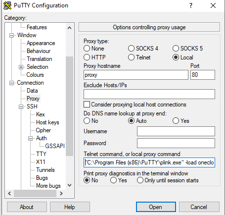  

## Connecting to the system  

### new method  
    1. save private key to a folder. 
        - 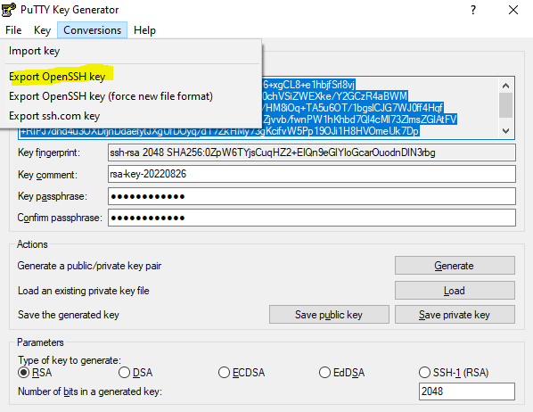  
    2. set the folder permision as per below
        -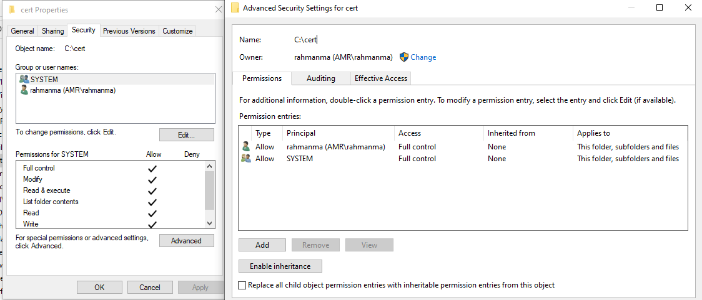  
    3. update the config file for ssh as below. 
    
    ```
    Host sshserver   
    HostName 192.55.64.252  
    User guest   
    identityfile "C:\cert\t.ssh"  
    #ProxyCommand "C:\Program Files\Git\mingw64\bin\connect.exe" -S PROXYSERVER:PROXYPORT %h %p   
    Host sdp  
    HostName 192.168.1.2  
    User sdp   
    ProxyCommand ssh.exe -W %h:%p sshserver   
    LocalForward 10443 192.168.1.3:443   
    LocalForward 10444 192.168.1.3:3389   
    LocalForward 10445 192.168.1.4:3389   
    LocalForward 10022 192.168.1.2:22  
    ```
    4. use the command ssh sdp to connect to tunnel.  
    5. rdp to localhost:10444  

### old method  

1. Double click the saved session `onecloudclient`  
	- when prompted for password use `$harktank2Go`  
1. Go To connection ->SSH -> tunnels 
	- configure tunnel information in the below example one is for remote desktop and the other is for ipkvm.  
	- 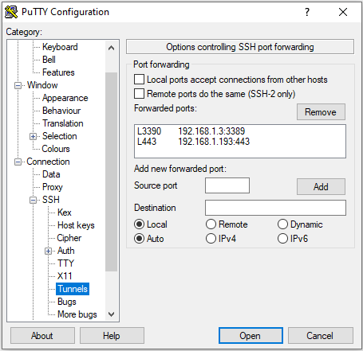  
1. To do file transfer setup SSH tunnel of 192.168.1.2:22 and use any SCP client application to localhost:22  
1. The username for KVM is `sdp` and password is `$harktank2Go`   
1. Now the client system is ready to connect to the lab SUT. 
1. For kvm connection click this link [https://localhost](https://localhost) . This should use local 443 port and access the kvm . 
	- 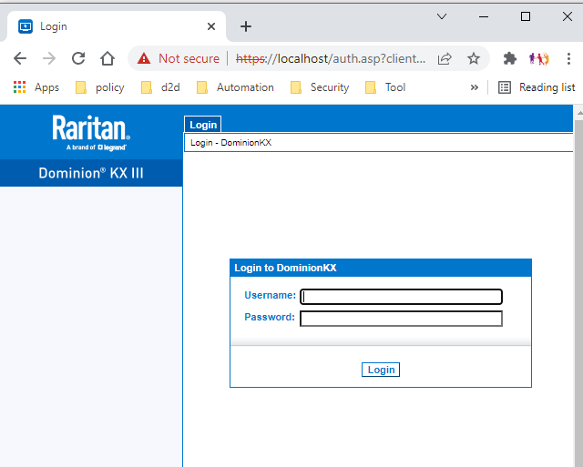  
	- user: tech  and password: redhat!test. now the KVM list of SUT should be available to connect. Double click on the name from that list.  
	-   
1. For RDP (remote desktop connection) use localhost:3390 . see the previous tunnel config ]  
	- 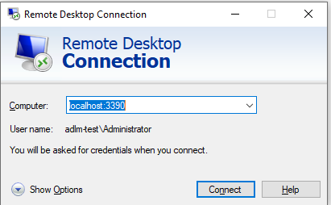  
	- user password for the system might vary. Administrator and no password is default. 
1. For file transfer need to have sftp tunnel configured on port 22. And need to ensure the SUT is running with the SFTP server on port 22.  
	- 


#### useful links 

[wiki for reserving system](https://wiki.ith.intel.com/display/onecloud/CCG+Cloud+FAQ#CCGCloudFAQ-HowtoReserve/ScheduleaSystemforInternalUse)  
[privacy notice](https://www.intel.com/content/www/us/en/privacy/intel-privacy-notice.html)  
[intel sdp access agreement](https://sdpconnect.intel.com/html/intel_sdp_access_agreement.htm)  
[configure ssh server on windows](https://winscp.net/eng/docs/guide_windows_openssh_server)  
-----  
