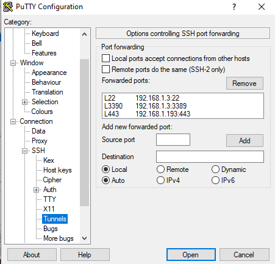

# Enable remote connectivity for Coengineering.

## Install / enable prerequisite  

1 Download and install putty. [download link](https://www.putty.org/)  
1 

## Register/reserve the system [should be done by Admin]  

## system information  

system id|locker id|gateway ip|certificate common name
---------|---------|----------|-----------------------
107269   |5061     |192.55.64.252|intelsdp5061

## Authenticate the client pc by adding public key 

1 launch `puttygen.exe` from putty installation location.  
1 click generate and keep moving mouse over the open area.  
1 **Make sure RSA is selected and Number of bits in a generated key is 4096 **  
	  
1 Enter a strong passphrase for key and confirm, then save the private key to a subfolder inside your Documents folder.  
	-**warning** do not click `save public key` button. 
	
1 select everything under `public key for pasting into OpenSSH authorized_keys file` and copy to notepad , save as MyPublicKey.  
1 you should have a instruction email with a link to provide public key.  
	- post the content of MyPublicKey to the link.  
	- **warning** it must starts with ssh-rsa  
	- close the puttygen.exe application.  

## Tunnel configuration  

### Gateway configuration

1 right click on the private key file and open with `Putty SSH authentication agent`.  
	- If prompted password please provide as setup earlier.  
1 launch putty.exe create a session called `onecloudgw` with host as `guest@<ssh-gw-server-ip-address>`.  
	-   
1 proxy should be configured if someone tries to access from intel VPN  
	- `connect %host %port\n`  
	- proxy: `proxy-us.intel.com`  `1080`  
	-   
1 For external access skip the previous step and select proxy none  
	
### client configuration

1 Launch putty.exe again and create a session **onecloudeclient**  
	- hostname: `sdp@<os ip address>`  
	- OS ip address can be obtained from the instructions email from intel SDP.  
	-   
1 Go to connection->proxy 
	- proxy type: `local`  
	- Telnet command or local proxy command: `"C:\Program Files (x86)\PuTTY\plink.exe" -load onecloudgw -nc %host:%port`  
	- **warning** confirm the putty installation path.  
	-   

## Connecting to the system  

1 Double click the saved session `onecloudclient`  
	- when prompted for password use `$harktank2Go`  
1 Go To connection ->SSH -> tunnels 
	- configure tunnel information in the below example one is for remote desktop and the other is for ipkvm.  
	-   
  
## useful links 

[wiki for reserving system](https://wiki.ith.intel.com/display/onecloud/CCG+Cloud+FAQ#CCGCloudFAQ-HowtoReserve/ScheduleaSystemforInternalUse)  
[privacy notice](https://www.intel.com/content/www/us/en/privacy/intel-privacy-notice.html)  
[intel sdp access agreement](https://sdpconnect.intel.com/html/intel_sdp_access_agreement.htm)  

---