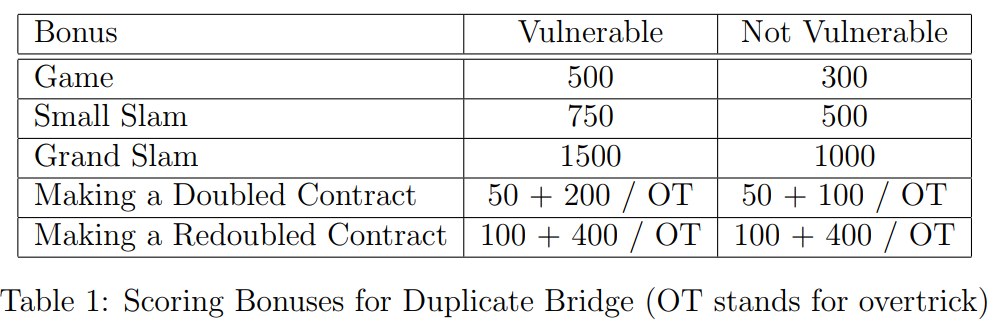
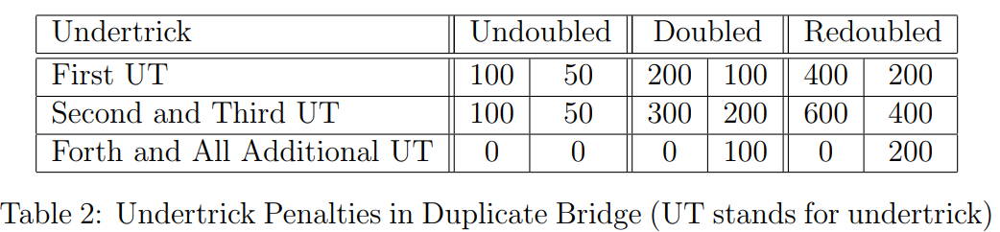

# Bridge 101  

# Index  
<a name="index">  
  [2♣](#2♣)   
  [1♥](#1♥)  
  [1♠](#1♠)  
  [1N](#1N)  
  [1♣](#1♣)  
  [1♦](#1♦)  
  [slam](#slam)  
  [score](#score)  
  [notes](#notes)  
  [weak 2 open](#wk2)  
  [4th Suite forcing](#fsf)  

  
<a name="2♣"/>

## Opening 2♣:  [△](#index)

    - Must have 23+ HCP (balance)   
    - Unbalance hand must have game possibility  
    - Partners must respond if oponent doesnt intercept.  
    - [acol](https://bridgebum.com/acol_2c.php)  
    
|N|S|N|S|N|S|Comment|
|--|--|--|--|--|--|--|
|2♣|  |  |  |  |  | 22+ hcp |
|2♣|2♦|  |  |  |  | <8 pts |
|2♣|2♥|  |  |  |  | 7+pts, 5+H|
|2♣|2♠|  |  |  |  | 7+pts,5+S|
|2♣|3♣|  |  |  |  | 7+pts,5+C|
|2♣|3♦|  |  |  |  | 7+pts,5+C|
|2♣|2N|  |  |  |  | no 5 card suit|
|2♣|3N|  |  |  |  | 10~12 HCP|

    
## Opening Major:
    - Must have 5 card and must have 12~21 HCP  
    
<a name="1♥"/>
### Hearts  [△](#index)
 

|N |S |N |S |N |S|Comment|  
|--|--|--|--|--|--|--|  
|1♥|  |  |  |  |  |5+H ,12~21 hcp, can not have 5S |  
|1♥|1♠|  |  |  |  |4+S ,7+ hc|  
|1♥|1N|  |  |  |  |6~12 pts, **1 round force**, opener must call,NO 4 card support, no 4 Spade, not a game hand |  
|1♥|1N|2m|  |  |  |3+m and continue call|  
|1♥|1N|2m|2♥|  |  |6~9 pts|  
|1♥|2m|  |  |  |  |13+dummy pts, **Game forcing**, 4+ card, dont stop until game call |  
|1♥|3♣|  |  |  |  |7-9 dummy pts, 4H [bergen raise](https://bridgebum.com/bromad.php)  |  
|1♥|3♦|  |  |  |  |10~12 dummy pts , 4H [bergen raise](https://bridgebum.com/bromad.php)  |  
|1♥|2♥|  |  |  |  |3+ cards, 8-10pts constructive raise |  
|1♥|3♥|  |  |  |  |0~6 dummy pts 4+H|  
|1♥|2N|  |  |  |  |15+ dummy pts, jacoby 2N , 4H |   
|1♥|2N|4m|  |  |  |5+m,1st priority/2N  |   
|1♥|2N|4♠|  |  |  |5+S|   
|1♥|2N|3X|  |  |  |singleton / void on X,2nd priority/2N|   
|1♥|2N|3N|  |  |  |14~15 pts, balance,3rd priority/2N|   
|1♥|2N|4♥|  |  |  |signoff, minimum hand |   
|1♥|2N|3♥|  |  |  |no other bid | 
|1♥|3N|  |  |  |  |13+ dummy pts, 3H|  
|1♥|4♣|  |  |  |  |13+ dummy pts,[splinter](https://bridgebum.com/splinters.php), shortness in C, 4H|  
|1♥|4♦|  |  |  |  |13+ dummy pts,splinter, shortness in D, 4H|  
|1♥|3♠|  |  |  |  |13+ dummy pts,splinter, shortness in S, 4H|  
|PA|1♥|2♣|  |  |  |Drury, 3+ support |  

<a name="1♠"/>
### Spades  [△](#index)
    
  
|N|S|N|S|N|S|Comment|  
|--|--|--|--|--|--|--|  
|1♠|  |  |  |  |  |5+S ,12~21 hcp , can have 5H|  
|1♠|1N|  |  |  |  |6~12 pts, **1 round force**, opener must call , no 4 card support, not a game hand |  
|1♠|1N|2m|  |  |  |3+m and continue call|  
|1♠|1N|2m|2♠|  |  |6~9 pts|  
|1♠|2m|  |  |  |  |13+dummy pts, 12+ pts ,**Game forcing**, 4+ card, dont stop until game call |  
|1♥|3♣|  |  |  |  |7-9 dummy pts, 4S[bergen raise](https://bridgebum.com/bromad.php) |  
|1♥|3♦|  |  |  |  |10~12 dummy pts , 4S[bergen raise](https://bridgebum.com/bromad.php) | 
|1♠|2♥|  |  |  |  |12+ pts, **Game forcing**, 5+ card, dont stop until game call |  
|1♠|2♠|  |  |  |  |3+ card,8-10pts constructive raise|  
|1♠|3♠|  |  |  |  |0~6 dummy pts 4+S, premptive raise|  
|1♠|2N|  |  |  |  |15+ dummy pts, jacoby 2N , 4S|  
|1♠|2N|4m|  |  |  |5+m,1st priority/2N  |   
|1♠|2N|4♥|  |  |  |5+H |   
|1♠|2N|3X|  |  |  |singleton / void on X,2nd priority/2N|   
|1♠|2N|3N|  |  |  |14~15 pts, balance,3rd priority/2N|   
|1♠|2N|4♠|  |  |  |signoff, minimum hand |   
|1♠|2N|3♠|  |  |  |no other bid |   
|1♠|3N|  |  |  |  |13+ dummy pts, 3S|  
|1♠|4♣|  |  |  |  |13+ dummy pts, [splinter](https://bridgebum.com/splinters.php), shortness in C, 4S|  
|1♠|4♦|  |  |  |  |13+ dummy pts, splinter, shortness in D, 4S|  
|1♠|4♥|  |  |  |  |13+ dummy pts, splinter, shortness in H, 4S|  
|PA|1♠|2♣|  |  |  |Drury, 3+ support |  

<a name="1N"/>
## Opening No Trump:  [△](#index)
    - you must have balance card with only one doubleton. 
    - No 5 card major
    - 15-17 HCP for 1N
    - 20-22 HCP for 2N 
    - stayman applies with no interference  
    

|N|S|N|S|N|S|Comment|
|--|--|--|--|--|--|--|
|1N|  |  |  |  |  | 15~17 hcp,MAX one doubleton even no block, no singleton,  |
|2N|  |  |  |  |  | 19~21 hcp,MAX one doubleton even no block, no singleton,  |
|2N|3♣|  |  |  |  | stayman|
|2N|3♦|  |  |  |  | jacoby xfer to H|
|2N|3♥|  |  |  |  | jacoby xfer to S|
|2N|4♣|  |  |  |  | Gerber , (Ace asking)|
|1N|2♣ |  |  |  |  | stayman asking for 4 card major |
|1N|2♣ |2♦|  |  |  | denies 4M|
|1N|2♣ |2♦|2♥|  |  | 4H,4S may be |
|1N|2♣ |2♦|2♠|  |  | 4S,no 4H |
|1N|2♣ |2♦|2N|  |  | invitational, 9pts|
|1N|2♣ |2♦|3♣|  |  | game forcing,6C |
|1N|2♣ |2♦|3♦|  |  | game forcing, 6D|
|1N|2♣ |2♥|  |  |  | 4H, may have 4S|
|1N|2♣ |2♥|3♣|  |  | game forcing,6C |
|1N|2♣ |2♥|3♦|  |  | game forcing,6D |
|1N|2♣ |2♠|  |  |  | 4S, denies 4H|
|1N|2♣ |2♠|3♣|  |  | game forcing,6C |
|1N|2♣ |2♠|3♦|  |  | game forcing,6D |
|1N|2♦|  |  |  |  | 5+ hearts card(jacoby xfer) |
|1N|2♦|2♥  |  |  |  | accept xfer |
|1N|2♥| |  |  |  | 5+ Spade card(jacoby xfer) |
|1N|2♥|2♠  |  |  |  | accept xfer|
|1N|2♠|  |  |  |  | transfer to C|
|1N|2N|  |  |  |  | transfer to D / No Trump|
  
  
## Opening Minor:  [△](#index)
    - must have 3 card minor with 12~21 HCP(most of the time 4 dice minimum and 3 clubs minimum) 

  
<a name="1♣"/>   
### Clubs    [△](#index)
      
|N|S|N|S|N|S|Comment|
|--|--|--|--|--|--|--|
|1♣| |  |  |  |  | 3+C ,12~21 hcp, no 4M/5D, C>=D|
|1♣|1♥|  |  |  |  | 4+H, 6+pts|
|1♣|1♠|  |  |  |  | 4+S, 6+pts|
|1♣|1N|  |  |  |  | no 4M , 7~9pts|
|1♣|2♣|  |  |  |  | 13+ dummy pts, 4+C|
|1♣|2M|  |  |  |  | weak jump shift|
|1♣|2N|  |  |  |  | 10~12 pts/ balanced. not jacoby 2N|
|1♣|3♣|  |  |  |  | 5~9 dummy pts, 4+C|  
|1♣|3N|  |  |  |  | 13~15 pts/ balanced|
   
   
<a name="1♦"/> 
### Dimonds   [△](#index)
    
|N|S|N|S|N|S|Comment|
|--|--|--|--|--|--|--|
|1♦| |  |  |  |  | 3+D/mostly 4+D |  
|1♦|1♥|  |  |  |  | 4+H, 6+pts|
|1♦|1♠|  |  |  |  | 4+S, 6+pts|
|1♦|1N|  |  |  |  | no 4M , 7~9 pts|
|1♦|2♣|  |  |  |  | 5~12 dummy pts, 6+C|
|1♦|2♦|  |  |  |  | 13+ dummy pts, 4+D|
|1♦|2M|  |  |  |  | weak jump shift|
|1♦|2N|  |  |  |  | 10~12 pts/ balanced. not jacoby 2N|
|1♦|3♦|  |  |  |  | 5~9 dummy pts, 4+D|  
|1♦|3N|  |  |  |  | 13~15 pts/ balanced|

<a name="fsf">
## Fourth suite Forcing:  [△](#index)
  
  
  - no intercept
  - no takeout double 
  - 4th suite is not lvl 1
  - typically applies with minor opening (not a 2 over 1)
  - opener doesnt reverse 

  
|N|S|N|S|N|S|Comment|
|--|--|--|--|--|--|--|
|1♦|1♠|2♣|2♥|  |  | H is 4th suite |  
|1♦|1♠|2♣|2♥|2♠|  | 3+S  |  
|1♦|1♠|2♣|2♥|2♦|  | D is long, 6-4 or 5-5 kind of |  
|1♦|1♠|2♣|2♥|2N|  | Block H /4th suite |  
|1♣|1♥|1♠|2♦|  |  | D is 4th suite |  
|1♣|1♥|1♠|2♦|  |  | D is 4th suite |  
|1♣|1♥|1♠|2♦|  |  | D is 4th suite |  
|1♣|1♥|1♠|2♦|  |  | D is 4th suite |  

<a name="slam"/>    
## Slam bidding:  [△](#index)

### Gerber over any *NT*  

|call|response|meaning| 
|--|--|--|
|4♣||asking for A|
|4♣|4♦|0/4 A|
|4♣|4♥|1 A|
|4♣|4♠|2 A|
|4♣|4N|3 A|
|5♣||asking for K|
|5♣|5♦|0/4 K|
|5♣|5♥|1 K|
|5♣|5♠|2 K|
|5♣|5N|3 K|  
  
  
### Blackwood convention
Dont use when
* holding 2 or more cards with no A/K (xx,Qx,jx)
* holding void
* 4NT is Blackwood if your side has never bid notrump naturally or if a major suit is agreed. 

|call|response|meaning| 
|--|--|--|
|4N||asking for A|
|4N|5♣|0/4 A|
|4N|5♦|1 A|
|4N|5♥|2 A|
|4N|5♠|3 A|
|5N||asking for K|
|5N|6♣|0/4 K|
|5N|6♦|1 K|
|5N|6♥|2 K|
|5N|6♠|3 K|

<a name="wk2"/> 
## Opening with weak hand: [△](#index)
    - if you are one of the first 2 caller. dont call 2 with good hand. 
    - open 2 of a suit other than clubs with 7~11 points with 6 card of the suit. only applies for first 2 caller. 
    - Prefered to have 2 of 5 top card apply judgement. 
    - For third / 4th hand when partner passed then need high points to call 2 of a suit

<a name="notes"/> 
## General Notes:  [△](#index)
    - redouble denies 3 card support
    - When defending at no trump NEVER lead your partner’s bid suit if you only have a singleton in his/her suit!!
      
### reverse
    - **reverse: ** skipping the second bid and go beyond 1♣-1X-2X, 1♦-1X-2♥♠, 1♥-1X-2♠
    - it requires a strong imbalance hand.  
    - it is a forcing call.  
    - very useful to notify partner about the strength. 
    - jump raise partners first/second suite. 
    - respond to 3N with 3rd suite block. 
    - [reverse bids](https://bridgebum.com/reverse_bids.php)  

### cue bidding / unusal 2N
    - no min point requires
    - typically good for weak / very strong. 
    - [cue biding](https://bridgebum.com/michaels_cuebid.php)  
    - [2N](https://bridgebum.com/unusual_2nt.php)
    - must not pass
      
|opponent|call open|meaning| 
|--|--|--|
|(1♣)|2♣|5+H and 5+S |
|(1♦)|2♦|5+H and 5+S|
|(1♥)|2♥|5+S and 5+m/respond 2N to ask m|
|(1♠)|2♠|5+H and 5+m/respond 2N to ask m|
|(1♣)|2N|5+H and 5+D  |
|(1♦)|2N|5+H and 5+C|
|(1♥)|2N|5+m both|
|(1♠)|2N|5+m both|
    
- Calculate short suit points  
    - doubleton : 1 pt each
    - singleton :  2 pt each/ 3pt if 4+ trump
    - void : number of trumps
- dummy points = HCP + short suit points  

### drury 
    
    - partner calls major after a pass 
    - 2♣ -> 3 card support with 10~ pts  

### Astro 
  
  - must respond for m
  - [Astro](https://bridgebum.com/astro.php)  

|opponent|call open|response|meaning| 
|--|--|--|--|
|(1N)|2♣||H+m 5-4 / 4-5 10+pts |
|(1N)|2♣|2♦|denies H, prefered m|
|(1N)|2♣|2♥|sign off|
|(1N)|2♣|2♠|6+S|
|(1N)|2♣|2N|12+pts , forcing to minor|
|(1N)|2♦||S+m 5-4 / 4-5 10+ pts|
|(1N)|2♦|2♥|denies S, prefered m|
|(1N)|2♦|2♠|sign off|
|(1N)|2♦|2N|12+pts , forcing to minor|
|(1N)|2♥||5+H 10+pts|
|(1N)|2♠||5+S 10+pts|

<a name="score"/>
   
## Scoring  [△](#index)
  
  
    
    
    