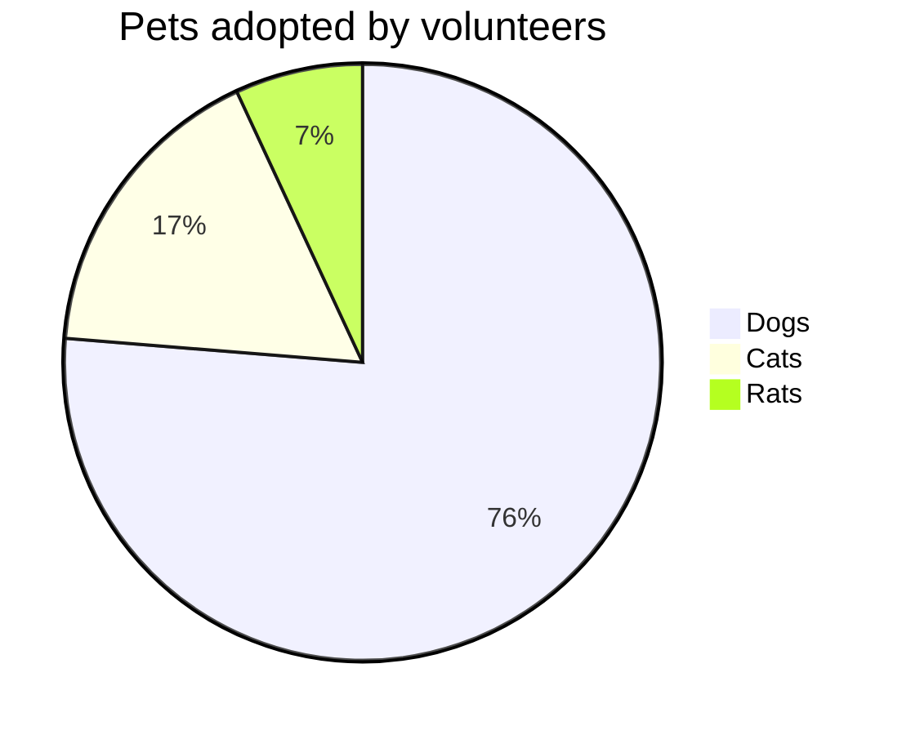

## simple common formating  

`<strike>stike</strike>` → <strike>stike</strike>  
`<del>strile</del>` → <del>strile</del>  
`<s>strike</s>` → <s>strike</s>  
`~~strike~~` → ~~strike~~  
`~strike~` → ~strike~  
`**bold**`-> **bold**  
`__bold__` -> __bold__  
`*italic*` -> *italic*  
`***italic***` -> ***bold italic***  

## list `- a` or `* b`
- a 
* b 
- c  

# This is a Heading h1
## This is a Heading h2  (has underline no underline after h2)
###### This is a Heading h6 (is the last header)


### Ordered list
```
1. a   
1. b   
1. c   
	1. d tab needed in the begining here
	1. e 2 space in the end is not must. 
``` 
  
1. a
1. b 
1. c
	1. d
	1. ef


## Images

``  


## Links
`[Markdown Live Preview](https://markdownlivepreview.com/)`  
[Markdown Live Preview](https://markdownlivepreview.com/).

## Blockquotes
`>`  
`>>`
> Markdown is a lightweight markup language with plain-text-formatting syntax, created in 2004 by John Gruber with Aaron Swartz.
>
>> Markdown is often used to format readme files, for writing messages in online discussion forums, and to create rich text using a plain text editor.  

now using tab below:  tab is equivalent to \`\`\`

	one tabe inserted in the begining.  
	continue second line.  
  
		tow tab here  
		continue two tab. 


## Tables
	
	notice the : for allignment. 
	| Left columns  | Right columns |
	| -:|:-:|
	| left foo      | right foo     |
	| left bar      | right bar     |
	| left baz      | right baz     |
 

  
newline before the first row of the table is must to show the table properly.  
double space at the end will ensure the new line.  
[more details on table and more ](https://github.github.com/gfm/#task-list-items-extension-)  
  

| Left columns  | Right columns |
| -:|:-:|
| left foo      | right foo     |
| left bar      | right bar     |
| left baz      | right baz     |
  
  
```
simple example
a|b  
-|-
1|2
```

|a|b|
|-|-|
|1|2|

## html scripting 
```<style
  type="text/css">
h1 {color:red;}

p {color:blue;}
</style>
okay
```
# head 1 test 

above color test failed   

	<span style="color:red">some **blue** text</span>  

<span style="color:red">some **blue** text</span>  
  
	**My Bold Text, in red color.**{: style="color: red; opacity: 0.50;" }  
  
**My Bold Text, in red color.**{: style="color: red; opacity: 0.50;" }  
  
	A blue and bold paragraph.  
	{: .blue .bold}  

A blue and bold paragraph.  
{: .blue .bold}  

	test{: .blue}  

test{: .blue}  

	test{: style="color: red;"}  

test{: style="color: red;"}  


	🔴 red: +5V  
	🟠 orange: +3.3V  
	⚫ black: ground  
	⚪ white: ground (pull-down)  
	🟣 purple: I2C signal  
	🟢 green: clock signal  
	🟡 yellow: WS2812 signal  
	🔵 blue: resistor bridge (analogue) input  

🔴 red: +5V  
🟠 orange: +3.3V  
⚫ black: ground  
⚪ white: ground (pull-down)  
🟣 purple: I2C signal  
🟢 green: clock signal  
🟡 yellow: WS2812 signal  
🔵 blue: resistor bridge (analogue) input  

	<style>
	.green {
	color: green;
	font-weight:700;
	font-size: 30px;
	}
	</style>
	<div class="green">
		Markdown css styles
	</div>  

<style>
.green {
    color: green;
    font-weight:700;
    font-size: 30px;
}
</style>

<div class="green">
    Markdown css styles
</div>


## HR
	___  
	---  
	***  

___
---
***


## html contents
```
|&copy;  |&uml; |&trade;|&iexcl; |&pound;|&amp;   |&lt;    |&gt;   |&yen;   |&euro; |&reg;    |&plusmn;|&para;| 
|&brvbar;|&macr;|&laquo;|&middot;|X&sup2;|&frac34;|&frac14;|&times;|&divide;|&raquo;|15&ordm;C|&sect;  |      | 
```

|&copy;  |&uml; |&trade;|&iexcl; |&pound;|&amp;   |&lt;    |&gt;   |&yen;   |&euro; |&reg;    |&plusmn;|&para; |
|--------|------|-------|--------|-------|--------|--------|-------|--------|-------|---------|-------|--------|
|&brvbar;|&macr;|&laquo;|&middot;|X&sup2;|&frac34;|&frac14;|&times;|&divide;|&raquo;|15&ordm;C|&sect; |        |


## Escaping for Special Characters

\*literal asterisks\*

## Markdown extras

## GFM task list
```
- [x] a
- [x] b
- [ ] c
    - [ ] c1
    - [ ] c2
    - [ ] c3
- [ ] d
    - [ ] d1
    - [ ] d2
```
- [x] a
- [x] b
- [ ] c
    - [ ] c1
    - [ ] c2
    - [ ] c3
- [ ] d
    - [ ] d1
    - [ ] d2


## TeX(LaTeX)

```
$$E=mc^2$$  
Inline $$E=mc^2$$ Inline 
$$\(\sqrt{3x-1}+(1+x)^2\)$$  
$$\sin(\alpha)^{\theta}=\sum_{i=0}^{n}(x^i + \cos(f))$$  
  

  
```
[help link](https://gist.github.com/a-rodin/fef3f543412d6e1ec5b6cf55bf197d7b)  
$$E=mc^2$$  
Inline $$E=mc^2$$ Inline，
Inline $$E=mc^2$$ Inline。
$$\(\sqrt{3x-1}+(1+x)^2\)$$  
$$\sin(\alpha)^{\theta}=\sum_{i=0}^{n}(x^i + \cos(f))$$  
  
  
  

  
### FlowChart

```flow
st=>start: Login
op=>operation: Login operation
cond=>condition: Successful Yes or No?
e=>end: To admin

st->op->cond
cond(yes)->e
cond(no)->op
```

## code block  

```python
if(x):
  print("this is x")
```  

``` ruby 
this = "Ruby Code"
puts "This is #{this}"
```  
``` javascript 
console.log('Code Tab A');
```
## mermaid test



## Add Image
  
[](http://www.youtube.com/watch?v=YOUTUBE_VIDEO_ID_HERE)  


[https://jekyllrb.com/docs/step-by-step/01-setup/](https://jekyllrb.com/docs/step-by-step/01-setup/)  
[markdown editor](https://stackedit.io/app#)
### End

